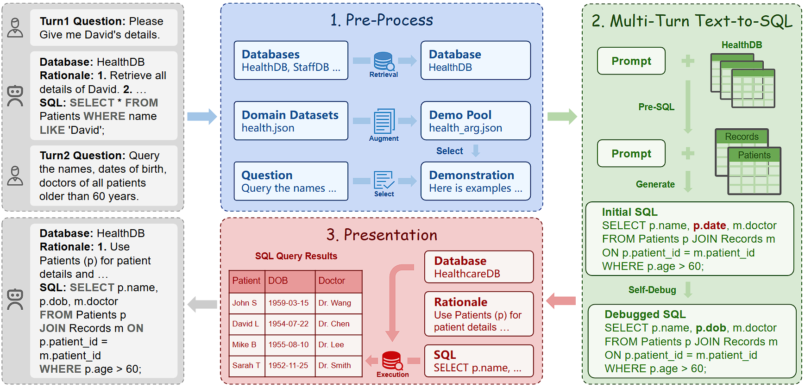

--
<div align="center" style="line-height: 1;">
    <a href="https://mp.weixin.qq.com/s/_llPtR4RWrH1QUQ9pvn7aQ" target="_blank" style="margin: 2px;">
        
    </a>
    <a href="https://github.com/starryneigh/Abacus-SQL" target="_blank" style="margin: 2px;">
        
    </a>
    <a href="https://huozi.8wss.com/abacus-sql/" target="_blank" style="margin: 2px;">
        
    </a>
    <a href="LICENSE" style="margin: 2px;">
        
    </a>
</div>
A Text-to-SQL System Empowering Cross-Domain and Open-Domain Database Retrieval



# What is Abacus-SQL?
AbacusSQL is a novel text-to-SQL system designed to address the limitations of existing systems, which often lack retrieval capabilities for open-domain databases, exhibit limited cross-domain transferability, and struggle with SQL query accuracy. To overcome these challenges, AbacusSQL employs database retrieval technology for precise identification of required databases, enhances cross-domain transferability through data augmentation methods, and incorporates Pre-SQL and self-debug methods to improve SQL query accuracy.
# Demo Video


# Get Started
## Only to use
To use Abacus-SQL, visit: https://github.com/starryneigh/Abacus-SQL, register your account, and start a new conversation to begin using it.
## Developing
1. Clone or download this repository:
    ```
    git clone git@github.com:starryneigh/Abacus-SQL.git
    ```

2. Install the dependencies:
    ```
    pip install -r requirements.txt
    ```

3. Configure environment variables in the .env file.

4. Start the Streamlit application:
    ```
    streamlit run app.py
    ```

# Credits
Wordflow is created by [Keyan Xu](https://github.com/starryneigh), [Dingzirui Wang](https://github.com/zirui-HIT/), [Xuanliang Zhang](https://zhxlia.github.io/).